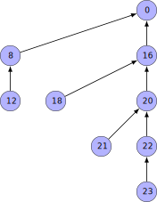
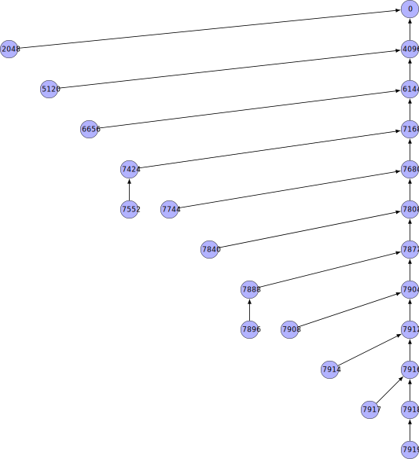

# Diffmonger

Diffmonger is an incremental backup tool for Linux that creates
ZFS snapshots and
stores them in a repository directory as encrypted incremental differences.
It was designed for backing up ZFS filesystems to
untrusted cloud file storage and providing resilience against ransomware attacks.


## Efficient incremental differences

Most incremental backup systems build chains of differences between consecutive snapshots,
with the chains being periodically broken and restarted from full images to avoid unbounded
linear growth.
Diffmonger is different.
It organises snapshots as nodes in a tree structure,
where each snapshot is stored as a difference relative to its parent,
forming a chain of differences anchored at the tree's root---the initial snapshot.
The depth of the tree,
and thus the maximum length of any chain,
grows logarithmically with the number of snapshots taken,
precluding the need to break chains to prevent linear growth.
<!--
it organises snapshots into a tree whose depth grows logarithmically with the number
of snapshots taken.
-->
<!--
Each node corresponds to a snapshot that is stored as a difference
relative to its parent.
-->

To limit overlap between stored differences,
diffmonger applies a pruning strategy.
As new nodes are added,
existing nodes are pruned so that the number retained is at most twice the tree's depth,
with spacing between retained nodes increasing geometrically with distance from
the most recent node.
<!-- This results in a snapshot coverage that is geometrically distributed through history,
so that there is always at least one retained snapshot within a factor of two
of any historical distance into the past. -->
This results in there always being at least one retained snapshot within a factor of two
of any historical distance into the past.

<!-- This results in dense preservation of recent snapshots,
with older snapshots become progressively sparser but never entirely vanish. -->

<!--
Snapshots are selectively pruned, introducing gaps between retained snapshots
that increase geometrically with distance from the most recent snapshot.
This retention scheme keeps the repository small,
so that the number of retained snapshots grows logarithmically
with the number of snapshots taken,
and skews retention granularity to favour more recent snapshots.


while still maintaining increasingly sparse coverage back to the initial snapshot:
traversing the retained snapshots from most recent to oldest yields gaps in coverage
that grow geometrically with distance from the present.
-->

## Security

Diffmonger was designed to be resilient against the following threat model:

- The repository may be intentionally shared with an untrusted remote server
  (see [Zero trust file storage](#zero-trust-file-storage)).
<!--  - Mitigation: Repository data is encrypted, except for ZFS snapshot GUIDs. -->
- The local system may become compromised by ransomware (or other malware or an attacker)
  and attempt to render remote mirrors
  of the repository useless,
  either by direct deletion of files
  or by flooding the repository with malignant snapshots in hope of forcing the remote
  mirror into pruning valid snapshots
  (see [Resilience to ransomware](#resilience-to-ransomware)).
<!-- - The local system may become compromised by ransomware and seek to
  directly delete
  remote copies of the repository (see [Resilience to ransomware](#resilience-to-ransomware)). -->
<!--  - Mitigations: immutable repository files, zero-trust prune operations
    (needing neither encryption passphrase nor access to the ZFS datasets),
    snapshot generation schedule and associated snapshot throttling by the
    remote server; see "Resilience to ransomware"
-->
- The repository may be become available to malicious parties who
  attempt to brute force
  the passphrase in the distant future with currently unavailable technology
  (see [Resilience to brute force attacks](#resilience-to-brute-force-attacks)).
<!--  - Mitigations:
    - Invocation from the command line supports part of the passphrase
      being read from a file descriptor, so that the total passphrase bit depth
      can be made vast, enabling a "what you have" security model.
    - A memory-hard key-derivation function is employed (Argon2id).
-->


<!--
Diffmonger is designed under a mutual zero-trust model:

- The storage server is untrusted.
- The local system may be compromised (e.g., by ransomware).
- Long-term repository exposure is assumed.

The system is therefore designed so that neither side is required to be trusted for
correctness, integrity, or pruning safety.
-->

### Zero-trust file storage

While diffmonger runs locally and does not establish network connections,
diffmonger is designed under the assumption that the user will mirror its
repository directory to an untrusted remote storage location.
To protect confidentiality,
diffmonger supports encryption of repository data
via the [libsodium](https://libsodium.org) library.
With encryption enabled, a diffmonger repository contains an asymmetric key pair,
with both the secret key and repository data encrypted using the
[XChaCha20-Poly1305](https://en.wikipedia.org/wiki/ChaCha20-Poly1305) algorithm.
Key derivation is performed with the memory-hard Argon2id algorithm.

While all payload data is encrypted,
some limited metadata is not. In particular,
ZFS snapshot GUIDs are not encrypted,
and so an attacker with access to both the repository and the ZFS dataset
will be able to verify that the repository relates to the dataset.
Additionally, the snapshot node number and timestamp are not encrypted.

### Resilience to ransomware

Diffmonger assumes that the local system may at any point become compromised
by ransomware, after which it can no longer be trusted.
To protect the integrity of any remote mirrors of the local repository,
files in diffmonger repositories are immutable once created.
Thus, any remote storage location should be configured to accept only new
files from the client,
and to never accept modifications or deletions of existing files.

Since the remote storage location will not reproduce file deletions,
diffmonger is designed to enable remote mirrors to handle their own
repository pruning. In particular, diffmonger exposes a dedicated
repository pruning command,
which does not require access
to either the encryption passphrase or the original zfs dataset
(_offline_ pruning).
Further, the pruning command quarantines new files so that a compromised local
system can not force remote pruning of valid snapshots by flooding the repository
with malignant snapshots.
When a repository is created,
a quarantining schedule is specified, which states the rate at which
new snapshots can contribute towards pruning;
incoming snapshots are throttled to this rate.
The approach is robust against forged timestamps
by virtue of the remote repository files being immutable once created,
so that while the malignant snapshots may have their timestamps forged to make them
appear older, they can never succeed in appearing older than the most recent
valid snapshot.

<!--
An infected client may attempt to trick the remote repository into pruning valid
snapshots by flooding the repository with spurious snapshots.
To protect against this, snapshots are timestamped and repositories can be configured
with anticipated snapshot generation rates.
Snapshots generated in excess of this rate are considered quarantined
and will not affect pruning until they exit their
quarantine period.
The approach is robust against attempts to forge timestamps by the client
by virtue of the remote repository files being immutable once created
and by virtue of pruning of the remote repository being performed with respect
to the remote repository's clock, which is outside the client's control.
-->

## Resilience to brute-force attacks

To provide defence against brute-force attacks, diffmonger:

i) supports multiple key slots and reading the passphrase from a file descriptor
   so as to facilitate use of hardware security tokens
   (see [Hardware security tokens](#hardware-security-tokens)),
ii) uses a memory-hard key derivation function, and
iii) supports reading additional passphrase material from a file descriptor
   (see [Key files](#key-files)).

### Hardware security tokens

By accepting the passphrase from a file descriptor,
the user is free to use external tooling to obtain an
[HMAC](https://en.wikipedia.org/wiki/HMAC)
from a hardware [security token](https://en.wikipedia.org/wiki/Security_token)
and communicate it to diffmonger via the file descriptor.
Each diffmonger repository has a stable UUID, which may be used as
salt material for the HMAC.

### Key files

Where a hardware security token is not available,
a key file may be created and stored on an external information storage device
(USB stick, QR code, pen and paper, etc)
and provided to diffmonger via file descriptor.
The derived key is computed from the concatenation of the file descriptor input
and the typed password.
Without the key file,
the repository cannot be decrypted.
However, unlike with a hardware security token,
if the attacker gains access to the key file, then they are able to perform an offline
brute force attack on the passphrase without being forced through the bottleneck of
a security token.
Therefore, use of a hardware security token is preferred if at all possible.


<!--

## Passphrase handling

Diffmonger accepts reading binary data from a file descriptor
that will be appended to the keyboard input passphrase prior to key derivation.
This enables integration with a
[security token](https://en.wikipedia.org/wiki/Security_token),
enabling a "what you have" security model.
If using an [HMAC](https://en.wikipedia.org/wiki/HMAC)
as the secret data,
then the repository's UUID can be used as the HMAC key.


Even without an security token,
robustness against brute force attacks in the future
can be substantially achieved by storing a high-entropy secret in a local file,
presumably also writing the same secret and writing the same secret
a "what you have" security model can be approximated by
storing a high-entropy secret in a local file


The data from the file descriptor,
which should have high entropy,
can come from a physical
or a local file.
It is possible for users without access to a security token to implement a poor man's
"what you have" encryption by storing a secret code

-->

# Tree structure

Diffmonger's tree structure and the invariants it satisfies
are central to its value as a backup tool.
This section introduces the tree and its value from a user perspective by way of examples.
It then goes on to define the mathematical structure of the tree and the invariants it
maintains.

Recall from the introduction that every snapshot taken by diffmonger results in a node
being inserted into a tree structure.
These nodes are assigned consecutive integer indices starting from 0.
Figure 1 shows the tree after 24 snapshots have been taken.
Recall that each snapshot is stored as a difference from its parent in the tree,
forming a chain anchored at the root.
Thus, to reconstruct the snapshot associated with node 23,
diffmonger applies the following chain of differences:
0, 16, 20, 22, 23. The snapshots associated with the other nodes in the tree
can be reconstructed in a similar way.

<!-- Only the shaded nodes are alive---all other nodes have been pruned
and their corresponding snapshots are no longer accessible. -->



The tree contains only 9 nodes despite 24 snapshots having been taken,
and so it is apparent that most snapshots were short lived and have since been pruned.
To visualise the sparsity of the tree,
Figure 2 shows the tree as it would exist had no nodes been pruned
(pruned nodes are unshaded).
This tree is a regular [Fenwick tree](https://en.wikipedia.org/wiki/Fenwick_tree).


The sparsity becomes increasingly extreme as more snapshots are taken.
Figure 3 shows the tree as it exists after 7920 snapshots have been taken
and Figure 4 shows the tree after 1,000,001 snapshots have been taken
(in both cases, showing only the alive nodes as the corresponding Fenwick trees are too large to visualise).




Despite the sparsity, each tree contains a high density of nodes near the
most recently inserted node.
For example, although the 1000001-tree contains only 27 nodes,
those nodes include 1000000, 999999, 999998, 999996, and 999992.
Represented as offsets from the most recently inserted node,
these are 0, -1, -2, -4, and -8.
While this initially appears to be a sequence of 0 followed by successive negative powers of two,
the sequence later goes on to make minor deviations from this pattern.
However, these deviations are minor (shifts and additional insertions)
and do not change the trend of an approximately doubling progression.

This density structure is perhaps most readily apparent by plotting
the nodes as spikes on a number line.
Figures 5, 6, and 7 show the nodes present in the 24-tree, 7920-tree, and 1000001-tree, respectively,
each plotted as upwards ticks on a number line with 0 at the left and values increasing to the right.
Also plotted are ticks at the positions of $\{n, n - 2^0, n - 2^1, \ldots\},$
where $n$ is the most recently inserted node.
While the upper ticks often do not align with the lower ticks,
they have a similar density structure.

<!-- ./build/diffmonger alive node=23 | \
   xargs ./tools/numberline-visualisation.pl >docs/comb.tex ; \
   ( cd docs ; latex comb.tex && dvisvgm comb.dvi --font-format=woff )
-->


With these examples in mind,
the benefit the density structure has for a backup system can now be shown.
Suppose that after taking the snapshot corresponding to node 1,000,000,
it is discovered that ransomware has been silently encrypting files for an unknown length of time.
The immediate instinct is to restore to the previous node, i.e., node 999,999.
However, upon doing so, it is discovered that the snapshot at this node is also affected,
and walking further back in snapshot history, it becomes apparent that the ransomware had been
silently encrypting files at a trickle rate for a prolonged period,
evading detection.
Perhaps investigation reveals that the system became compromised 241 snapshots ago,
i.e., corresponding to node 999,759.
Unfortunately, this node no longer exists at the time of the ransomware being discovered (node 1,000,000),
however,
two nodes are nearby: nodes 999,680 and 999,808.
Despite only 27 nodes spanning a history of 1,000,001 snapshots,
it was possible to find a node only 79 snapshots prior to the target node.

## Mathematical details

The tree's unusual structure arises from two functions,
$$P(n) = n - \operatorname{LSB}(n),$$ and
$$T(n) = n + 3\cdot\operatorname{LSB}(n),$$
where $n \in \mathbb{Z}_{> 0}$ and
$\operatorname{LSB}(n)$ is the value of the least significant set bit of $n$
(i.e., so that if $n = \sum_{i \geq 0} \: c_i 2^i$, then $\operatorname{LSB}(n) = \min_{i \geq 0} \: c_i 2^i$).
<!-- (i.e., in C notation with `n` being an unsigned integer, `LSB(n) == n & -n`). -->
<!-- If $n \in \mathbb{Z}_{\geq 0}$ is a node in the tree, then $P(n)$ is its parent
and $T(n)$ is the point at which it shall be pruned from the tree
(i.e., so that after taking the $T(n)$-th snapshot, counting from 0, the $n$-th node shall no longer exist).
These functions are defined as follows: -->
If $n$ is a non-root node in the tree, then $P(n)$ is its parent
and $T(n)$ is the point at which it shall be pruned from the tree
(i.e., so that after insertion of node $T(n)$, node $n$ shall no longer exist).
It immediately follows that the set of nodes alive after the insertion of node $n$
is given by
$$A_n = \{ k \in \mathbb{Z} \: | \: k \geq n \wedge T(k) > n \}.$$

These dynamics give rise to the following three invariants:

1. After insertion of node $n$,
   a path exists from the inserted node to the root that is $O(\log n)$ in depth
   (lifetime invariant).
   <!-- The path in the tree from the $n$-th snapshot to the initial snapshot is ${O(\log n)}$. -->
1. The total number of stored snapshots in the diffmonger repository at the time of
   taking the $n$-th snapshot is ${O(\log n)}$ (repository size invariant).
1. After insertion of node $n$,
   then for all $m \in \mathbb{Z}$, $0 < m \leq n$,
   there always exist at least one alive node in
   $\left\{k \in \mathbb{Z} \: | \: n - m \; \leq \; k \; \leq \; n - \lfloor m/2 \rfloor\right\}$
   (node distribution invariant).

<!--
Snapshot coverage remains geometrically distributed through history,
so that there is always at least one retained snapshot within a factor of two
of any historical distance into the past.
-->

## Efficiency analysis

Diffmonger's tree structure necessarily incurs some space overhead and write amplification
compared to storing snapshots as an unbroken linear chain of differences.
Assuming that each snapshot introduces 1 unit of new, unique, incompressible data
(i.e., so that compression and deduplication opportunities do not apply),
then a linear chain is the optimal storage mechanism for avoid space overhead and write amplification.
Diffmonger's amortised space consumption is a factor of 2.5 times the optimal,
and its amortised write amplification grows with the logarithm of the number of snapshots taken.
A repository with $2^28$ commits will incur a total write amplification of 15x the optimal.

# Usage

## Repository initialisation

To use diffmonger to backup a target dataset, first a repository must be created:

```bash
diffmonger R="$path" init zfs
```

## Key pair initialisation

Encryption is enabled by default, although can be disabled if required by setting
`encryption=false`. If encryption is enabled,
then a subsequent command is necessary to initiate a key-pair:

```bash
diffmonger R="$path" init-keypair  # Prompts for a password
```

## Taking snapshots

At this point,
the repository is ready for creating and storing snapshots:

```bash
diffmonger R="$path" snapshot dataset="$zfs_dataset"
```

This command creates a zfs snapshot, running `zfs snapshot` on the given dataset,
and receives and stores the snapshot by means of `zfs send`.
The created snapshot must remain in the dataset and should never be deleted by the user.
A typical configuration is for a cronjob to run the `snapshot` command at a regular interval.

## Recovering from a snapshot

At any point,
a snapshot from the repository can be recovered to a given dataset:

```bash
diffmonger R="$path" restore dataset="$zfs_dataset"
```

**Restoration is destructive**: existing data and snapshots are irrecoverably lost.
It is therefore expected to restore to a temporary dataset rather than restoring on top of
existing data.

The `restore` command accepts a `node` parameter for restoring to a specific point:

```bash
diffmonger R="$path" restore dataset="$zfs_dataset" node="$node"
```

If left unspecified, the command restores to the most recently taken snapshot.

## Offline pruning

As described in [Resilience to ransomware](#resilience-to-ransomware),
if the repository is being mirrored to remote file storage,
then the remote system should be responsible for performing its own
pruning and should not reproduce file deletions from the source repository.
Pruning is "offline": it does not require the encryption passphrase
and it does not require access to the zfs dataset.

```bash
diffmonger R="$path" prune-repository
```


## Caveats

### Interactions with non-diffmonger snapshots

Diffmonger assumes it is the sole snapshot manager for its given dataset.
This is as it would not normally make sense to directly create snapshots on that dataset
outside of the diffmonger command. The reasons for this are:

1. Diffmonger does not preserve existing snapshots in its storage format
   (the underlying `zfs send` command is given neither `-R` nor `-I` parameters),
   and so manually created snapshots would not be backed up.
2. Manual use of `zfs rollback` will in the general case
   destroy diffmonger snapshots,
   which will result in future errors when creating subsequent diffmonger snapshots.

If it is ever required to manually create a snapshot outside of the normal
snapshot schedule, then the `diffmonger snapshot` command can be invoked directly,
which will result in both a zfs snapshot being created and the same snapshot
being backed up in the repository. This snapshot can then be restored to by the
normal `diffmonger restore` mechanism. Note, however, that it continues to not
be recommended or supported to restore to a live dataset,
and so the snapshot should be restored to a temporary dataset and
the filesystem contents transferred to the live dataset with `rsync`
or other tool.
This is currently required because restoring to a node other than the most recent
has the effect of deleting the more recent nodes from the restored dataset,
which means that subsequent `diffmonger snapshot` commands will not work
on the restored dataset. This is recognised as a limitation and a fix is planned.

### Immutable initialisation

The repository can only be initialised once,
at which point its initialisation parameters become immutable.
If it is later desired to change initialisation parameters
(e.g., to enable or disable encryption),
then the repository must be exported with the `export-repository` command.


### Non-goals and limitations

Diffmonger provides no means for offline (i.e., without decryption)
verification of repository integrity.
This is intentional: there are existing widely available solutions for preventing
and/or detecting corruption at a memory level (e.g., ECC memory),
a filesystem level (e.g., zfs, btrfs),
and at a file transfer level (e.g., rsync),
and so the principal of separation of concern dictates
that these tools should be used rather than diffmonger reimplementing their functionality
locally.


## Grammar

Various diffmonger commands need to accept vector arguments in a way that is not well supported
by the traditional `getopt` grammar.
In order to eliminate any potential for quoting bugs,
diffmonger introduces a new grammar,
which is defined in eBNF notation as:


       argv = subcommandargv { <$> subcommandargv }
       subcommandargv = subcommandname { <$> param }
       param = paramname paramvalue
       paramvalue = ":" [assignvalue] { <$> assignvalue }
                  | "=" value { <$> assignvalue }
                  | "+=" value
       assignvalue = "=" value

where `argv` is the input arguments array
(i.e., as represented by `argc`/`argv` in `main()`),
`<$>` represents advancing to the next element in the `argv` array,
and `value` represents arbitrary data (binary or otherwise).

In cases where there are no vector arguments,
this grammar results in a mix between `git` style subcommands and `dd` style argument processing:

       command param1:=value sub-command param2:=value

However, it is possible for either parameter to unambiguously accept a vector of arguments:

       command param1:=value1 =value2 =value3 sub-command param2:=value1 =value2 =value3

It is also possible for a parameter to accept a zero-vector argument:

       command param:

This is distinct to accepting a single empty-string argument:

       command param:=

The colon in the `:=` syntax for initiating a vector assignment is optional if the argument
is not the empty vector, in which case the grammar exactly mimics that of `dd`,
other than for accepting sub-commands:

       command param1=value sub-command param2=value

Additionally, to facilitate scripting, it is possible to append to and/or reset existing vector arguments:

       command param+=value1 param+=value2 param+=value3 param=newvalue1 param+=newvalue2

In the above, `param` was initially assigned the vector `[value1, value2, value3]`,
but was then reassigned with the vector `[newvalue1, newvalue2]`.
This is useful in scripts that let the user append additional arguments to a command:

       command param="default value" "${USERARGS[@]}"

(using bash syntax far appending each element of the bash `USERARGS`
variable to the end of the command arguments).
For bash scripts that seek to assign a parameter from a vector bash variable,
the pattern substitution syntax can be used:

       command param:"${paramvalues[@]/#/=}"

This allows assignment of arbitrary vector values from bash variables without any
risk of shell escaping issues. Similar syntaxes are available in other shells.
The same syntax can be used to append to an already set parameter:

       command param=initial0 =initial1 "${additionalvalues[@]/#/param+=}"

# Driver model

Diffmonger is in principle filesystem agnostic
as it separates its business logic from its filesystem logic
by means of a backend driver interface.
However, currently a driver only exists for zfs,
but diffmonger has been designed with btrfs and git support in mind.
(Paired with git, diffmonger serves a different use case:
creating secure git vaults that persist by means of encrypted git bundles.)

# Summary/Highlights

- Logarithmic snapshot retention and reconstruction complexity
- Efficient space utilisation and quantified write amplification
- Sparse Fenwick history structure
- Append-only repository format suitable for cloud storage
- Strong encryption (XChaCha20-Poly1305 + Argon2id)
- Hardware-token and key-file support for multi-factor security
- Offline pruning for zero-trust storage environments
- Ransomware-resistant repository design
- Filesystem-agnostic driver architecture
- Novel CLI grammar

# Status

Diffmonger is a work in progress.
It is functional for its intended use cases,
but is not production ready, and until its first release,
the repository format may change without warning.
